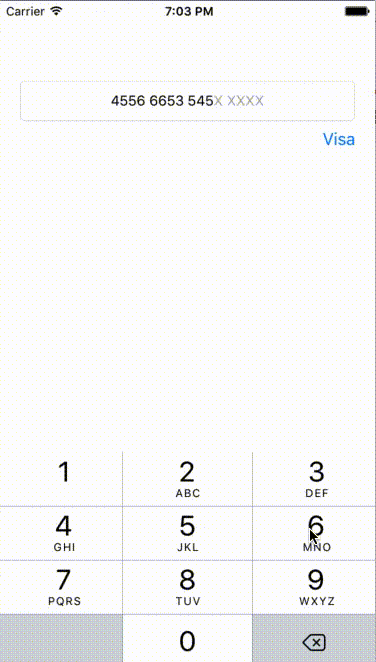

Use Credit Card Text Field class.

It is capable of doing following things:

1. Find out which card number is being enetered. i.e. Visa, MasterCard
2. Can check is credit card number is correct or not.
3. Will allow number of digits according to card type.
4. Also can change placeholder text according to card type.

